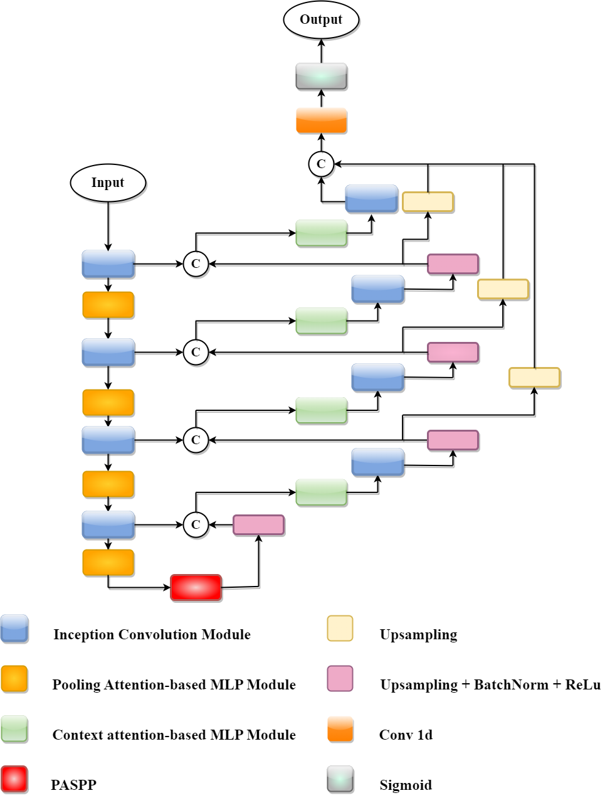

# [**CPA-Unet-A-Solution-for-Left-Ventricle-Segmentation-from-Magnetic-Resonance-Images**]
PyTorch code for paper [CPA-Unet-A-Solution-for-Left-Ventricle-Segmentation-from-Magnetic-Resonance-Images](https://ieeexplore.ieee.org/abstract/document/10227237), 2023 International Conference on System Science and Engineering (ICSSE). 


## Abstract
Medical image segmentation is a crucial first step in the development of healthcare and rehabilitation systems, particularly for the identification and planning of cardiovascular issues. In recent years, convolutional neural networks (CNNs) have produced outstanding results on a number of medical image segmentation tasks. Particularly the U-shaped architecture, also known as U-Net, has been extremely successful and set the de facto standard. U-Net often demonstrates difficulties in clearly expressing long-range dependency, nevertheless, as a result of the innate locality of convolution operations. In this study, we propose a new neural network architecture, namely CPA-Unet  for problems involving cardiac image segmentation. The CPA-Unet model, which employs cutting-edge Deep Learning methods, more successfully provides better extraction of features for the segmentation of desired segmented objects, whereas earlier models did not contribute much because they ignored the details of the channel, spatial, and contextualization on big datasets. Our experiments upon this Sunnybrook Cardiac dataset and the ACDC dataset show that CPA-Unet outperforms other modern models in terms of the Dice coefficient and IoU metric, highlighting it's own applicability for biomedical image segmentation solutions.
## Datasets
Our paper using two datasets:
- ACDC Dataset: 70% for training, 15 % for validation and 15% for testing [Link data](https://drive.google.com/drive/folders/1HTMWQUXvGAOSShZx4m9zVvLsL394XHr3?usp=sharing)

- Sunny Brook Dataset: 70% for training, 15 % for validation and 15% for testing [Link data](https://drive.google.com/drive/folders/19xB8LmzUMkLH3dfPtgedafNxVSEFI44w?usp=sharing)

_All images in experiments resized to 256x256_
## Citation
```
@inproceedings{vu2023cpa,
  title={CPA-Unet: A Solution for Left Ventricle Segmentation from Magnetic Resonance Images},
  author={Vu, Ngoc-Tu and Pham, Viet-Tien and Pham, Van-Truong and Tran, Thi-Thao},
  booktitle={2023 International Conference on System Science and Engineering (ICSSE)},
  pages={33--38},
  year={2023},
  organization={IEEE}
}
```


